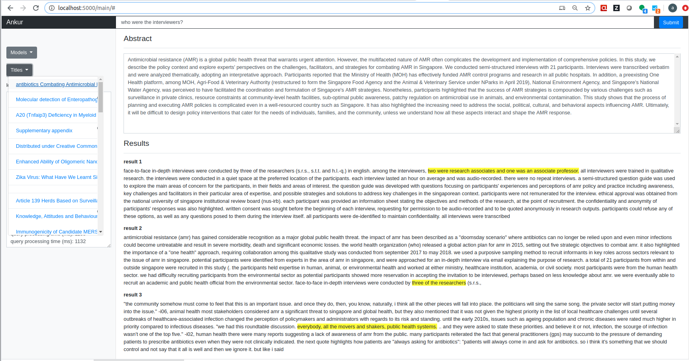

# Fast question-answering on Covid-19 dataset using BERT style models finetuned on Squad 2

**Covid-19 Fast QA** is an interactive experimental tool leveraging a state-of-the-art language model to search relevant content inside the [COVID-19 Open Research Dataset (CORD-19)](https://pages.semanticscholar.org/coronavirus-research) recently published by the White House and its research partners. The dataset contains over 44,000 scholarly articles about COVID-19, SARS-CoV-2 and related coronaviruses.

The system uses [`bert-large-uncased-whole-word-masking-finetuned-squad`](https://huggingface.co/transformers/pretrained_models) and my own `bert-base-uncased-finetuned-squad` models to perform fast question-answering on documents in the Covid-19 dataset. Fast inference is achieved by tokenizing the document content during pre-processing and then adjusting the tok-to-orig indices based on the number of tokens in the query. This results in a 5x speed up over the default transformers implementation which performs tokenization for every query. 

A couple of screenshots of the system frontend (query results are marked in yellow) are shown below. 




## Setup

Tested on: Ubuntu 18.04, with 1080Ti GPU. Docker version 19.03.5

First clone the repo. Then, [download](https://drive.google.com/open?id=1kV1thNFPFCKGBEv6nKxUE0Dy7Vl2tG6N) the bert-large and bert-small models finetuned on Squad 2 to /data/models. If you have trouble downloading the models (sometimes Google Drive hangs while trying to perform a virus scan on large binary files), browse into the individual model directories on Google drive, download vocab.txt, config.json and pytorch_model.bin, create the directories for the two models manually on your host machine and copy over vocab.txt, config.json and pytorch_model.bin to the respective model directories. For bert-base-uncased_finetuned_squad model, your directory structure should like this:

```angular2
/data/models/bert-base-uncased_finetuned_squad model
   -vocab.txt
   -pytorch_model.bin
   -config.json
```
Similarly for bert-large-uncased-whole-word-masking-finetuned-squad.

Easiest way to run the demo is using Docker. Included Dockerfile will do the following:
* Install Ubuntu 18.04 with CUDA 10.1
* Install Python3.7 and Pip
* Install Pytorch 1.4 with CUDA support 
* Install other dependencies - Flask, Gunicorn, Transformers etc.
* Copy parent directory to /app in Docker container (except the contents of the models directory, see .dockerignore). We'll map the models directory on the host to the container when we run the container.
* Start a gunicorn server on 0.0.0.0/5000

Docker command: 
```angular2
docker build -t covid-papers-analysis .
```

## Running without GPU Support
To run the docker container without GPU support:
```angular2
docker run -p 5000:5000 -v ~/dev/apps/ML/covid-papers-analysis/data/models:/app/data/models -e PYTHONUNBUFFERED=1 -it covid-papers-analysis:latest
```
The `-v` option maps the model directory on the host to /app/data/models so you don't have to copy the model files into the container. Please change the models directory path to the correct path on your computer in the command above. 

## GPU Support
To enable GPU acceleration within the Docker container, follow these [instructions](https://github.com/NVIDIA/nvidia-docker). 

```angular2
# Add the package repositories
distribution=$(. /etc/os-release;echo $ID$VERSION_ID)
curl -s -L https://nvidia.github.io/nvidia-docker/gpgkey | sudo apt-key add -
curl -s -L https://nvidia.github.io/nvidia-docker/$distribution/nvidia-docker.list | sudo tee /etc/apt/sources.list.d/nvidia-docker.list

sudo apt-get update && sudo apt-get install -y nvidia-container-toolkit
sudo systemctl restart docker
```

To run with GPU support, set the `USE_GPU` environment variable
```angular2
docker run -p 5000:5000 -v ~/dev/apps/ML/covid-papers-analysis/data/models:/app/data/models -e USE_GPU=1 -e PYTHONUNBUFFERED=1 --gpus all -it covid-papers-analysis:latest
```

Once the container is running, open a browser and type: http://localhost:5000/main/

Select the model from the Models dropdown list, pick a paper title from the Titles dropdown. 
